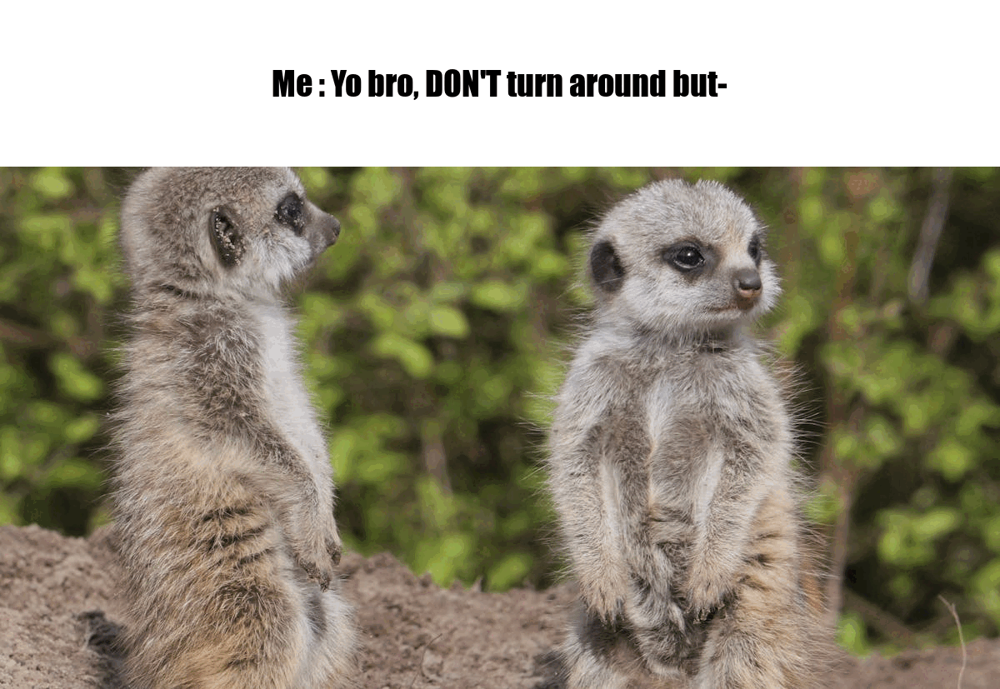

```{r setup, include=FALSE}
knitr::opts_chunk$set(echo=TRUE, message=FALSE, warning=FALSE, error=FALSE)
library(tidyverse)
library(knitr)

selected_photos <- read_csv("selected_photos.csv")
```

```{css echo=FALSE}

body {
  font-family:  "Times New Roman", serif;
  line-height: 1.6;
  max-width: 900px;
  margin: auto;
  padding: 20px;
  background: linear-gradient(155deg, #B5E2FA, #F9F7F3,#EDDEA4, #F7A072 );
  font-size: 15px;
}
p {
    font-family: "Times New Roman", Helvetica, Roboto, sans-serif;
    font-size: 15px;
}

h1 {
  font-family: Inter,  Helvetica , Roboto, sans-serif;
  color: #2C3E50;
  font-weight: 600;
}

h2 {
  font-family: Inter, Helvetica , Roboto, sans-serif;
  color: #2C3E50;
  font-weight: 600;
}

h3 {
  font-family:  Inter, Helvetica, Roboto, sans-serif;
  color: #2C3E50;
  font-weight: 600;
}

img {
  max-width: 100%;
  height: auto;
  display: block;
  margin: 0 auto;
  
}

```
## Introduction

"Cool" "Meerkats"

I picked these two words because I really like meerkats and wanted a random adjective. So I picked "Cool". I felt like if I used a more niche or distinct adjective then I wouldn't get many good results. Also meerkats are cool so it's a redundant term in my books.

[Cool Meerkats](https://www.pexels.com/search/cool%20meerkats/) 


All photos generally show meerkats in their natural habitat. Some, but not many, of the photos show them in enclosures. They are mostly candid photos, though sometimes the meerkats would notice the photographer and look into the camera. There is also a good mix of photos that are taken landscape vs portrait. They are also all VERY VERY CUTE.

```{r}
table <- selected_photos %>% select(url)
knitr::kable(table) 
```

## Key features of my selected Photos
```{r}
number_of_rows <- nrow(selected_photos)

large_image <- selected_photos %>%
  select(width, height) %>%
  filter(width >= 4000 | height >= 6000) %>%
  nrow()

photographer_count <- selected_photos %>%
  count(photographer, sort = TRUE)

longer_than_my_name <- selected_photos %>%
  filter(str_detect(photographer_longer_than_my_name, "nah YEA")) %>%
  nrow()

total_width <- selected_photos$width %>%
  sum()

```
There are `r number_of_rows` in the selected photo csv. This is due to only 16 photographers using the term "Meerkats" in their url.

A Large image is defined as often exceeding 4000x6000 pixels. Of my 16 images, `r large_image` of them fit this description as being a large image for high-resolution photography

Out of the 16 photographers, the photographer who appeared the most in my selected_photos csv was `r photographer_count %>% select(photographer) %>% slice(1)`, who appeared a total of `r photographer_count %>% select(n) %>% slice(1)` times.

There are `r longer_than_my_name` number of photographers whose name is longer then mine is.

Though useless, the sum of all the widths in my data is `r total_width`.

## Creativity



I wasn't too creative this time. But in journey to create a meme, I needed to be able to zoom into the image because I needed to emphasies that the meerkats is looking in the direction of the camera. So I looked for another magick function that could let me do this. I really enjoyed making this meme like usual. I believe this is relatively creative because I had to highlight the fact that the meerkat is looking straight into the camera, and not just that in this image there is a meerkat looking into the camera, so I had to find a way to do this.

I did have a bit of fun with the ifelse function. Not exactly creative, but I wrote different strings for if the result is TRUE or FALSE. Not sure if that counts as creative, but I did that.

Now that I think about it, something different I did do was made a new variable (via mutate) if the photographers name had more characters than my name, which is not CRAZY creative but its not common. I also made a new variable if the photographer calls them "Meerkats" or "Meercats" and then later only included the rows where they were called Meerkats.

I also had to be a little creative when making the summary values. Especially if I wanted to find summary values that give somewhat useful information regarding the dataset. Like I made a new column for if the photographers names were larger then mine. And then in exploration.R I had found the mean height grouped by whether their names were bigger then mine or not. 


## Learning reflection

I really like using the ifelse function. One important idea I learnt is how to manipulate variables in a dataframe in R. I've done something similar in python and I can say, doing it in R is a lot better and a lot easier. One thing I also have learnt is how valuable the pipe is, it makes everything so much easier.

I want to work with databases, in 3A, we briefly touched on SQL and SQL functions. I would like to expand my knowledge in that region, or perhaps do some work with relatively humongous databases. Otherwise, this API stuff I have never touched upon in my life and I didn't know it exists so I would be happy to take a deeper dive into using APIs.

## Appendix

```{r file='exploration.R', eval=FALSE, echo=TRUE}

```
```{r file='project3_report.Rmd', eval=FALSE, echo=TRUE}

```

