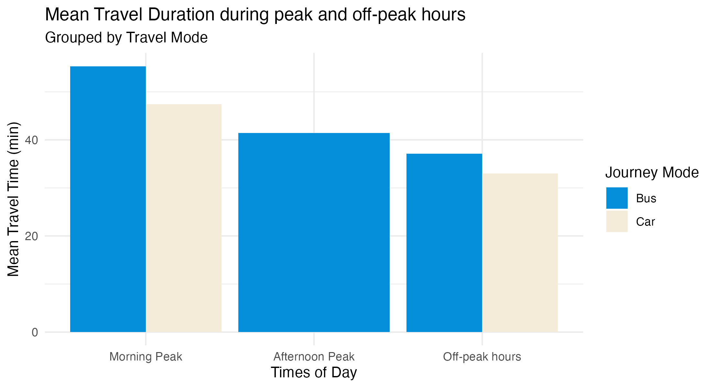
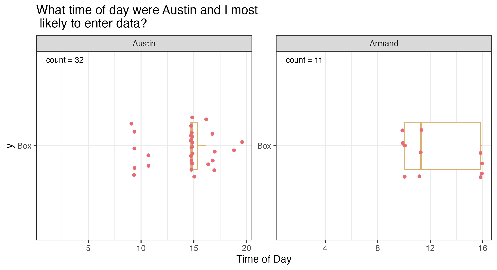
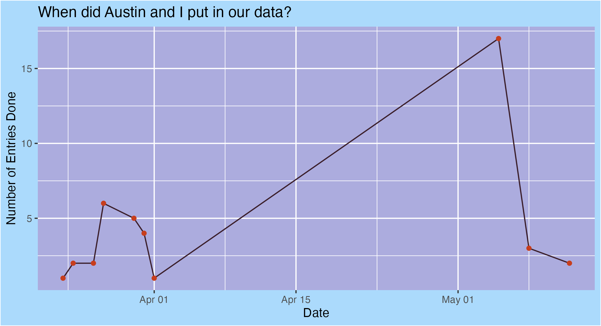

<script src="https://code.jquery.com/jquery-3.7.1.min.js" integrity="sha256-/JqT3SQfawRcv/BIHPThkBvs0OEvtFFmqPF/lYI/Cxo=" crossorigin="anonymous"></script>

```{r setup, include=FALSE}
knitr::opts_chunk$set(echo=FALSE, message=FALSE, warning=FALSE, error=FALSE)
```

```{js}
$(function() {
  $(".level2").css('visibility', 'hidden');
  $(".level2").first().css('visibility', 'visible');
  $(".container-fluid").height($(".container-fluid").height() + 300);
  $(window).on('scroll', function() {
    $('h2').each(function() {
      var h2Top = $(this).offset().top - $(window).scrollTop();
      var windowHeight = $(window).height();
      if (h2Top >= 0 && h2Top <= windowHeight / 2) {
        $(this).parent('div').css('visibility', 'visible');
      } else if (h2Top > windowHeight / 2) {
        $(this).parent('div').css('visibility', 'hidden');
      }
    });
  });
})
```

```{css, echo = FALSE}
.figcaption {display: none}

body {
  font-family: "Helvetica", "Arial", sans-serif;
  background-color: #f7f3ed;
  color: #2b2b2b;
  line-height: 1.6;
}

h1, h2, h3 {
  color: #7b3f61;
  font-weight: 700;
}

h1 {
  border-bottom: 3px solid #d7af70;
  padding-bottom: 10px;
}

h2 {
  margin-top: 35px;
  border-left: 6px solid #e76b74;
  padding-left: 12px;
}

p {
  font-size: 16px;
}

img {
  border-radius: 12px;
  box-shadow: 0px 4px 14px rgba(0, 0, 0, 0.18);
  margin: 15px 0;
}

pre {
  background-color: #2b2b2b;
  color: #f8f8f2;
  border-radius: 10px;
  padding: 15px;
}

code {
  background-color: #eee1d2;
  color: #7b3f61;
  padding: 2px 5px;
  border-radius: 5px;
}

blockquote {
  border-left: 5px solid #d7af70;
  background-color: #fffaf2;
  padding: 12px 18px;
  font-style: italic;
}
</style>
```

## Graph Numero Un



So this graph is pretty similar to the one I made in Project 2. It compares the mean travel time between the different parts of the day. So Morning peak, afternoon peak and off peak hours. For this case, morning peak is defined as being between 6:30am and 8:30am, afternon peak is 3:30pm-6pm and off peak is just any other time. Journey modes are also being compared here side by side to demonstrate what generally takes longer

The visualisation shows us that morning peak generally took longer on average then it does for afternoon peak or off peak hours. With bus journey's generally being longer then car travel duration. There is no data for Car in Afternoon peak because none of us travelled to and from uni between 3:30pm and 6pm by car.

`peak_peak_count$mean %>% select`

Whats interesting is that the mean bus journey time for afternoon peak is not that much longer then off-peak hours. But what makes sense is car travel time is almost always faster then bus travel time. 

## Graph Numero deux


Descrition: The Y values mean nothing, they are spaced out like that so we can actually see the individual points properly.

Utilising facets is a tremendous idea here. Looking at this graph we can see a few things. We see two graphs, one labelled Austin and one labelled Armand. Austin's interquartile range is a lot smaller then Armand's IQR. Despite having more then 3x the number of observations than Armand does, his data is much more closer together. Which concludes that he is a lot more consistent in logging data in terms of timing and also relative consistency. Not only having triple Armand's observations but he also tends to put his observations down at 3pm or 10am. He is so consistent, his IQR is genuinely a line. Armand's data doesn't really tell a great story because 1) it is very inconsistent and 2) there is only 11 observations.

## Graph numero trois


This graph, again showing metadata, draws a timeline of how often observations were logged and when they were. We can see that it is touched upon slightly in the days leading up to April. And from then, it was never touched (as shown by how their are no dots between Apr 1st and May 2nd-ish), before jumping to an enourmous 18 observations. This is likely due to Project 4 being worked on by both Austin and I, subsequently many observations were put in.

One story that we do figure out from looking at the two graphs above is from what we see about 18 observations were logged on May 4th. And in the second plot, many observations were logged at about 3pm. So perhaps, Austin was not consistent (Armand didn't log on May 4th, I know, I was there), and simply looked into his AT data and just logged them all at the same time. Which if he did, he deserves some glaze.

## Wait, another dancing cat?


## A dance team of kittens!


