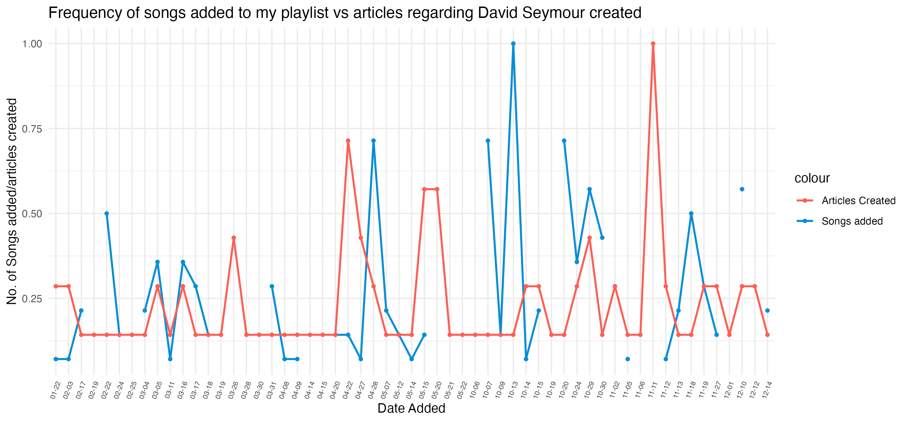
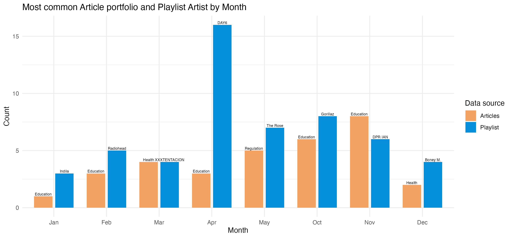

```{css, echo = FALSE}

body {
  font-family: "Helvetica", "Arial", sans-serif;
  background: linear-gradient(135deg, #f8fafc, #c7d2fe );
  color: #2b2b2b;
  line-height: 1.6;
}

h1, h2, h3 {
  color: #7b3f61;
  font-weight: 700;
}

h1 {
  border-bottom: 3px solid #d7af70;
  padding-bottom: 10px;
}

h2 {
  margin-top: 35px;
  border-left: 6px solid #e76b74;
  padding-left: 12px;
}

p {
  font-size: 16px;
}

img {
  border-radius: 12px;
  box-shadow: 0px 4px 14px rgba(0, 0, 0, 0.18);
  margin: 15px 0;
}

pre {
  background-color: #2b2b2b;
  color: #f8f8f2;
  border-radius: 10px;
  padding: 15px;
}

code {
  background-color: #eee1d2;
  color: #7b3f61;
  padding: 2px 5px;
  border-radius: 5px;
}

blockquote {
  border-left: 5px solid #d7af70;
  background-color: #fffaf2;
  padding: 12px 18px;
  font-style: italic;
}

```

## Introduction

In  beehive.govt.nz, I decided to search by David Seymour because he is a pretty interesting guy. Always getting the most amount of hate, much of it being justified, much of it not. Regardless he seems to be THE MOST controversial member of parliament despite not ever being prime minister. You can only describe him by saying "What a guy".

The second dataset I used comes from my own spotify listening data, utilizing Spotify for Developers

I took five pages because I felt that three pages was not enough considering the other data set I was working with.

According to the copyright section of the beehive website. I can only use and reproduce the data free of charge if I reproduce it accurately and acknowledge the source of the material. 

The data used in this project was collected from Beehive.govt.nz, the official New Zealand Government website for ministerial releases and speeches. I acknowledge Beehive as the source of my data. 

https://www.beehive.govt.nz/minister/hon-david-seymour pages 1,2,3,4, and 5 were used. ALl data was viewed 26/27 May 2026.

Wikipedia API scraping was also used, but remained untouched for data manipulation and visualisation creation.

I'm not sure how to reference it. But my last data set involved was from Spotify 2026. Using teh Web API on the Spotify for Developers Website. And I got meta data from my own spotify account. All data was vieweed 26/27 May 2026.

**In order to use the Web API for Spotify, AI and CHATGPT was used and the code can be found in spotify_api_scrape.R in the Project 5 folder**

## Visualisation

I made two because I felt that with all the work I put into getting the work, I really wanted to do two. My first visualisation is to see if there is any sort of relationship between the dates where articles were made about David Seymour in beehive.govt.nz and when I added songs to my main playlist. I am happy to say that there is absolutely zero correlation.



In my second graph, I compared the highest occurring portfolio for articles created each month to the highest occurring artist of whose songs I added to my main playlist each month. Again, there seems to be absolutely zero correlation but it was interesting to see regardless. I love to see that I added a few Boney M songs to my playlist in december for Christmas.



In a way my visualizations are a success. This is because regarding both variables in each instance, we hypothesise there is no correlation and we will see no pattern. And in this way, the appearance of a pattern would signify something peculiar and strange, but I can happily conclude that NOTHING is percuilar or strange here.


## Creativity

My visualizations themselves are not very creative, they use basic functions to build up the graph itself plus some extras. The only creative thing I did was get more data... some very very personalized data. I was inspired by Liza as the assignment page mentioned that we can demonstrate creativity by connecting personal interest. So I connected my spotify account. And let me tell you, what a JOURNEY that was. Lemme break it down for you.


So I was initially working with the beehive and wikipedia scraped data. But then I found myself staring at both datasets for about 40min and trying to figure out how was I even supposed to join these datasets together without creating an excessive amount of rows due to joining them together. 

So I had to think, if I used other datasets from other websites; what **primary key** could I even use. How could I possibly link something random to DAVID FREAKING SEYMOUR? The only reasonable answer is the date. So I thought, let me try my luck with a manhwa website I use. Turns out scraping asurascans.com doesn't work well because the website isn't exactly built well. Then I tried youtube, but NOOOO. It turns out they don't actually let you (or they don't have it) see popular videos from specific dates. Consequently I turned to Spotify, because HEY, it doesn't get more personalised then my music. From this, I had the bright idea of using my own Spotify metadata. But who could know how much of a hassle it was to get CHATGPT to write an R.script to even get this to happen. I had to tell spotify I WAS MAKING AN APP. And I had to get a client ID and Client code. Which was cool because it was similar to what we did in project 3. And with Chatgpt, it took about NINETY MINUTES to even let me start processing the data and turn it into visualisations. NINETY!!

Despite my usage of AI, I still believe this idea was creative as it opened a new world to me. I was made aware that you can use API to get data from websites, but here I experimented with it mostly by myself. I feel justified using AI because when it came to scraping data from beehive and wikipedia, the code to gain data from both websites was given to us and we did not need to build it ourselves. So I got the means to access the data I wanted and then used it the way I wanted to without the usage of AI.

Truely...
Truely a journey of all time

## Learning Reflection

I've learnt how complicated Website Scraping and API stuff is. I've learnt how diabolically difficult and weird it is. It is so bad that Liza makes the code for us FIRST. I had no idea it was this difficult to code for scraping, and all the theory that goes behind it. I am whooped.

But using this, I am actually quite curious to learning how to get better at this data scraping stuff. I can get some pretty cool data and find out new things with them. I would really enjoy being able to get better at this kind of stuff. It would make, making projects a lot easier and a lot more fun

## Self Review

 HOW TO USE R. Thats the main one, but I guess I can split it up.
 
 1. Making visualisations
 I think this is quite an important one, albeit one of the knows I dislike the most. At the end of the day, most statistical studies end with making the graph and then thats most of the job done. So making them are extremely important. The usage of ggplot, utilizing its inner functions, the different types of graphs and all the stupid little changes you can add to the theme.
 
 2. Manipulating Data
 Knowing how to manipulate the data is equally as important as making the visualizations if not more so. I am happy to say that my ability to manipulate data in R has reached a level where if I see a data set and I want to make a graph, I roughly know what kind of code I need to put down in order to make it happen. Obviously I am not AMAZING at it, but it is an amazing skill to have now. Got to make your data tidy!!

## Additional Comments

Yes I did not use stringr functions. However I used an abundance of dplyr and lubridate functions. I simply felt I had no need to use stringr functions so I did not use them so PLEASE don't penalise me for not using it and instead using functions I ACTUALLY needed.

## Appendix

```{r file='scrape_html.R', eval=FALSE, echo=TRUE}

```
```{r file='data_sources.R', eval=FALSE, echo=TRUE}

```
```{r file='visualisation.R', eval=FALSE, echo=TRUE}
